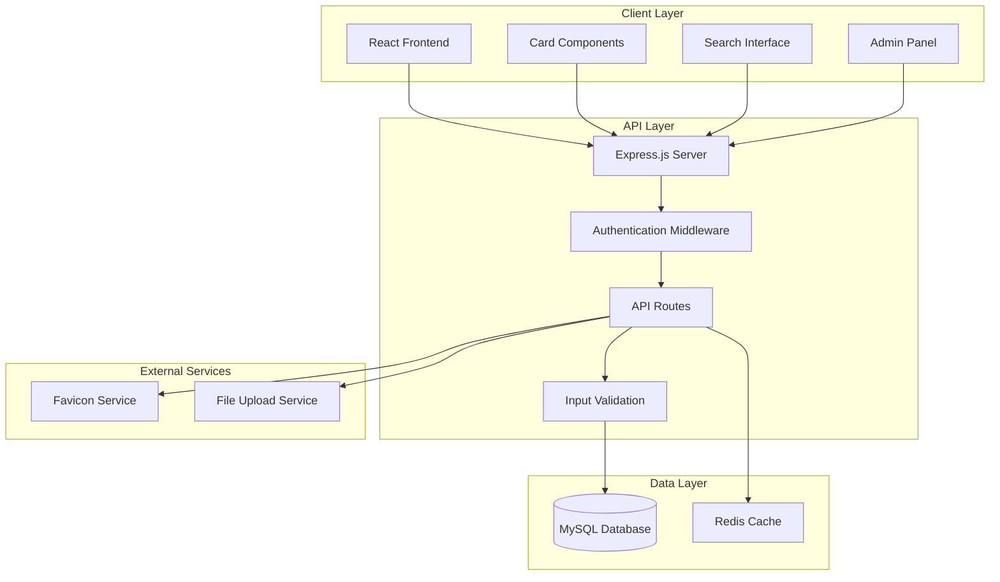

# Design Document: Enterprise Navigation Tool

## Overview

The Enterprise Navigation Tool is a web-based application built with Node.js, Express, and MySQL that provides a unified interface for managing enterprise website links. The system features a card-based responsive UI, multi-user support with role-based access, and comprehensive administrative capabilities for managing default configurations.

The application follows a three-tier architecture with a React-based frontend, Express.js REST API backend, and MySQL database for persistence. The design emphasizes user experience through intuitive card layouts, drag-and-drop functionality, and efficient search capabilities.

## Architecture

### System Architecture



### Technology Stack

- **Frontend**: React 18 with TypeScript, CSS Grid/Flexbox for responsive layouts
- **Backend**: Node.js 18+ with Express.js 4.x framework
- **Database**: MySQL 8.0 with mysql2 driver for connection pooling
- **Authentication**: JWT tokens with bcrypt for password hashing
- **Caching**: Redis for session management and favicon caching
- **File Storage**: Local filesystem with multer for icon uploads
- **Favicon Extraction**: Custom service using node-get-favicons library

## Components and Interfaces

### Core Components

#### 1. User Management Component
```typescript
interface User {
  id: number;
  username: string;
  email: string;
  passwordHash: string;
  role: 'user' | 'admin';
  createdAt: Date;
  lastLoginAt: Date;
}

interface UserService {
  authenticate(username: string, password: string): Promise<AuthResult>;
  createUser(userData: CreateUserRequest): Promise<User>;
  getUserById(id: number): Promise<User>;
  updateUser(id: number, updates: Partial<User>): Promise<User>;
}
```

#### 2. Website Link Management Component
```typescript
interface WebsiteLink {
  id: number;
  userId: number;
  name: string;
  url: string;
  description?: string;
  iconUrl?: string;
  groupId: number;
  sortOrder: number;
  isActive: boolean;
  createdAt: Date;
  updatedAt: Date;
}

interface LinkService {
  createLink(linkData: CreateLinkRequest): Promise<WebsiteLink>;
  updateLink(id: number, updates: Partial<WebsiteLink>): Promise<WebsiteLink>;
  deleteLink(id: number, userId: number): Promise<void>;
  getUserLinks(userId: number): Promise<WebsiteLink[]>;
  reorderLinks(userId: number, linkOrders: LinkOrder[]): Promise<void>;
}
```

#### 3. Group Management Component
```typescript
interface Group {
  id: number;
  userId: number;
  name: string;
  description?: string;
  sortOrder: number;
  isActive: boolean;
  createdAt: Date;
  updatedAt: Date;
}

interface GroupService {
  createGroup(groupData: CreateGroupRequest): Promise<Group>;
  updateGroup(id: number, updates: Partial<Group>): Promise<Group>;
  deleteGroup(id: number, userId: number): Promise<void>;
  getUserGroups(userId: number): Promise<Group[]>;
}
```

#### 4. Default Configuration Component
```typescript
interface DefaultConfiguration {
  id: number;
  name: string;
  description: string;
  configData: ConfigurationData;
  version: number;
  isActive: boolean;
  createdBy: number;
  createdAt: Date;
}

interface ConfigurationData {
  groups: DefaultGroup[];
  links: DefaultLink[];
}

interface ConfigurationService {
  getActiveConfiguration(): Promise<DefaultConfiguration>;
  createConfiguration(configData: ConfigurationData): Promise<DefaultConfiguration>;
  updateConfiguration(id: number, configData: ConfigurationData): Promise<DefaultConfiguration>;
  applyToUser(userId: number, configId: number, strategy: 'reset' | 'merge'): Promise<void>;
}
```

#### 5. Favicon Service Component
```typescript
interface FaviconService {
  extractFavicon(url: string): Promise<string>;
  cacheFavicon(url: string, iconData: Buffer): Promise<string>;
  getFaviconUrl(domain: string): Promise<string>;
  uploadCustomIcon(file: Express.Multer.File): Promise<string>;
}
```

### API Endpoints

#### Authentication Endpoints
- `POST /api/auth/login` - User authentication
- `POST /api/auth/logout` - User logout
- `GET /api/auth/me` - Get current user info
- `POST /api/auth/refresh` - Refresh JWT token

#### User Management Endpoints
- `GET /api/users/profile` - Get user profile
- `PUT /api/users/profile` - Update user profile
- `POST /api/users` - Create new user (admin only)

#### Link Management Endpoints
- `GET /api/links` - Get user's links with groups
- `POST /api/links` - Create new link
- `PUT /api/links/:id` - Update existing link
- `DELETE /api/links/:id` - Delete link
- `PUT /api/links/reorder` - Reorder links and groups

#### Group Management Endpoints
- `GET /api/groups` - Get user's groups
- `POST /api/groups` - Create new group
- `PUT /api/groups/:id` - Update group
- `DELETE /api/groups/:id` - Delete group

#### Search Endpoints
- `GET /api/search?q=query` - Search links by name, description, tags
- `GET /api/recent` - Get recently accessed links
- `GET /api/favorites` - Get favorited links

#### Admin Endpoints
- `GET /api/admin/config` - Get default configuration
- `PUT /api/admin/config` - Update default configuration
- `POST /api/admin/config/publish` - Publish configuration changes
- `GET /api/admin/users` - Get all users
- `POST /api/admin/users/:id/reset` - Reset user to default config

#### Utility Endpoints
- `POST /api/favicon/extract` - Extract favicon from URL
- `POST /api/favicon/upload` - Upload custom icon
- `POST /api/import` - Import links from CSV/Excel
- `GET /api/export` - Export links to CSV/Excel

## Data Models

### Database Schema

```sql
-- Users table
CREATE TABLE users (
  id INT PRIMARY KEY AUTO_INCREMENT,
  username VARCHAR(50) UNIQUE NOT NULL,
  email VARCHAR(255) UNIQUE NOT NULL,
  password_hash VARCHAR(255) NOT NULL,
  role ENUM('user', 'admin') DEFAULT 'user',
  created_at TIMESTAMP DEFAULT CURRENT_TIMESTAMP,
  last_login_at TIMESTAMP NULL,
  is_active BOOLEAN DEFAULT TRUE
);

-- Groups table
CREATE TABLE groups (
  id INT PRIMARY KEY AUTO_INCREMENT,
  user_id INT NOT NULL,
  name VARCHAR(100) NOT NULL,
  description TEXT,
  sort_order INT DEFAULT 0,
  is_active BOOLEAN DEFAULT TRUE,
  created_at TIMESTAMP DEFAULT CURRENT_TIMESTAMP,
  updated_at TIMESTAMP DEFAULT CURRENT_TIMESTAMP ON UPDATE CURRENT_TIMESTAMP,
  FOREIGN KEY (user_id) REFERENCES users(id) ON DELETE CASCADE,
  INDEX idx_user_sort (user_id, sort_order)
);

-- Website links table
CREATE TABLE website_links (
  id INT PRIMARY KEY AUTO_INCREMENT,
  user_id INT NOT NULL,
  group_id INT NOT NULL,
  name VARCHAR(200) NOT NULL,
  url TEXT NOT NULL,
  description TEXT,
  icon_url VARCHAR(500),
  sort_order INT DEFAULT 0,
  is_favorite BOOLEAN DEFAULT FALSE,
  access_count INT DEFAULT 0,
  last_accessed_at TIMESTAMP NULL,
  is_active BOOLEAN DEFAULT TRUE,
  created_at TIMESTAMP DEFAULT CURRENT_TIMESTAMP,
  updated_at TIMESTAMP DEFAULT CURRENT_TIMESTAMP ON UPDATE CURRENT_TIMESTAMP,
  FOREIGN KEY (user_id) REFERENCES users(id) ON DELETE CASCADE,
  FOREIGN KEY (group_id) REFERENCES groups(id) ON DELETE CASCADE,
  INDEX idx_user_group_sort (user_id, group_id, sort_order),
  INDEX idx_user_favorite (user_id, is_favorite),
  FULLTEXT idx_search (name, description)
);

-- Default configurations table
CREATE TABLE default_configurations (
  id INT PRIMARY KEY AUTO_INCREMENT,
  name VARCHAR(100) NOT NULL,
  description TEXT,
  config_data JSON NOT NULL,
  version INT DEFAULT 1,
  is_active BOOLEAN DEFAULT FALSE,
  created_by INT NOT NULL,
  created_at TIMESTAMP DEFAULT CURRENT_TIMESTAMP,
  FOREIGN KEY (created_by) REFERENCES users(id)
);

-- User sessions table
CREATE TABLE user_sessions (
  id VARCHAR(128) PRIMARY KEY,
  user_id INT NOT NULL,
  expires_at TIMESTAMP NOT NULL,
  created_at TIMESTAMP DEFAULT CURRENT_TIMESTAMP,
  FOREIGN KEY (user_id) REFERENCES users(id) ON DELETE CASCADE,
  INDEX idx_user_expires (user_id, expires_at)
);

-- Favicon cache table
CREATE TABLE favicon_cache (
  id INT PRIMARY KEY AUTO_INCREMENT,
  domain VARCHAR(255) UNIQUE NOT NULL,
  icon_url VARCHAR(500) NOT NULL,
  cached_at TIMESTAMP DEFAULT CURRENT_TIMESTAMP,
  expires_at TIMESTAMP NOT NULL,
  INDEX idx_domain_expires (domain, expires_at)
);
```

### Frontend State Management

```typescript
interface AppState {
  user: User | null;
  groups: Group[];
  links: WebsiteLink[];
  searchResults: WebsiteLink[];
  recentLinks: WebsiteLink[];
  favorites: WebsiteLink[];
  loading: boolean;
  error: string | null;
}

interface UIState {
  activeGroupId: number | null;
  searchQuery: string;
  viewMode: 'grid' | 'list';
  draggedItem: DraggedItem | null;
  showAdminPanel: boolean;
}
```

## Correctness Properties

*A property is a characteristic or behavior that should hold true across all valid executions of a system-essentially, a formal statement about what the system should do. Properties serve as the bridge between human-readable specifications and machine-verifiable correctness guarantees.*

Based on the prework analysis, the following properties validate the system's correctness:

### Authentication and User Management Properties

**Property 1: Valid authentication grants access**
*For any* valid user credentials, authentication should succeed and grant access to the user's personal configuration
**Validates: Requirements 1.1**

**Property 2: Invalid authentication is rejected**
*For any* invalid credentials, authentication should fail and return an appropriate error message
**Validates: Requirements 1.2**

**Property 3: New user initialization**
*For any* newly created user, their configuration should be automatically initialized with the current default configuration
**Validates: Requirements 1.3, 4.2**

**Property 4: User data isolation**
*For any* pair of users, modifications to one user's configuration should not affect the other user's configuration
**Validates: Requirements 1.4, 2.3**

**Property 5: Role-based access control**
*For any* administrative operation, it should only be accessible to users with administrator role
**Validates: Requirements 1.5**

### Link and Group Management Properties

**Property 6: Link creation completeness**
*For any* valid link data (name, URL, description, group), creating a link should store all provided fields correctly
**Validates: Requirements 2.1**

**Property 7: Link update integrity**
*For any* valid link update, the operation should preserve data integrity and update only the specified fields
**Validates: Requirements 2.2**

**Property 8: Favicon extraction attempt**
*For any* URL provided during link creation, the system should attempt to extract a favicon
**Validates: Requirements 2.4**

**Property 9: Favicon fallback availability**
*For any* failed favicon extraction, manual icon upload or selection options should be available
**Validates: Requirements 2.5**

**Property 10: Group creation persistence**
*For any* valid group name, creating a group should add it to the user's configuration with the specified name
**Validates: Requirements 3.1**

**Property 11: Group-link relationship integrity**
*For any* link assigned to a group, the relationship should be maintained correctly in the system
**Validates: Requirements 3.2**

**Property 12: Reordering persistence**
*For any* reordering operation on links or groups, the new arrangement should be persisted correctly
**Validates: Requirements 3.3**

### Configuration Management Properties

**Property 13: Default configuration updates affect new users**
*For any* administrator update to default configuration, subsequently created users should receive the updated configuration
**Validates: Requirements 4.1**

**Property 14: Configuration versioning**
*For any* change to default configuration, the version number should be incremented correctly
**Validates: Requirements 4.5**

### UI and Display Properties

**Property 15: Card display completeness**
*For any* website link, the card display should include icon, name, and description elements
**Validates: Requirements 5.1, 5.4**

**Property 16: Card click navigation**
*For any* card click event, the associated website should open in a new tab or window
**Validates: Requirements 5.2**

**Property 17: Group separation in UI**
*For any* set of groups, they should be displayed as separate tabs or sections in the interface
**Validates: Requirements 3.5, 5.3**

### Search and Access Properties

**Property 18: Search result relevance**
*For any* search query, returned results should match the query terms in name, description, or tags
**Validates: Requirements 6.1**

**Property 19: Recent access tracking**
*For any* website access, the system should track it and make it available in recent access lists
**Validates: Requirements 6.2**

**Property 20: Favorite link handling**
*For any* link marked as favorite, it should receive priority display or quick access treatment
**Validates: Requirements 6.3**

**Property 21: Real-time search suggestions**
*For any* search input, suggestions should be provided as the user types
**Validates: Requirements 6.5**

### Import/Export Properties

**Property 22: Import validation and parsing**
*For any* valid CSV or Excel file upload, the system should parse and import links with proper validation
**Validates: Requirements 7.1**

**Property 23: Export completeness**
*For any* export request, the generated file should contain all configuration data
**Validates: Requirements 7.2**

**Property 24: URL validation during import**
*For any* imported data, invalid URL formats should be detected and reported
**Validates: Requirements 7.3**

**Property 25: Batch operation consistency**
*For any* set of batch operations, they should be applied consistently without partial failures
**Validates: Requirements 7.5**

### Administrative Properties

**Property 26: Configuration publishing**
*For any* administrator configuration change, publishing should make reset and sync options available to users
**Validates: Requirements 9.2**

**Property 27: System statistics display**
*For any* administrator status request, user activity and configuration statistics should be displayed
**Validates: Requirements 9.4**

**Property 28: Audit logging completeness**
*For any* administrative action or configuration change, it should be recorded in audit logs
**Validates: Requirements 9.5**

<function_calls>
<invoke name="prework">
<parameter name="featureName">enterprise-navigation-tool

## Error Handling

### Error Categories and Responses

#### Authentication Errors
- **Invalid Credentials**: Return 401 with clear error message
- **Expired Token**: Return 401 with token refresh instruction
- **Insufficient Permissions**: Return 403 with role requirement details

#### Validation Errors
- **Invalid URL Format**: Return 400 with specific validation failure details
- **Missing Required Fields**: Return 400 with list of missing fields
- **Data Type Mismatches**: Return 400 with expected format information

#### Resource Errors
- **Link Not Found**: Return 404 with resource identifier
- **Group Not Found**: Return 404 with group identifier
- **User Not Found**: Return 404 with user identifier

#### System Errors
- **Database Connection Failure**: Return 503 with retry instruction
- **External Service Unavailable**: Return 502 with fallback options
- **File Upload Errors**: Return 413/415 with size/type limitations

#### Favicon Service Errors
- **Favicon Extraction Failure**: Log error, provide default icon, continue operation
- **Network Timeout**: Use cached favicon or default, retry in background
- **Invalid Image Format**: Reject upload with supported format list

### Error Response Format
```typescript
interface ErrorResponse {
  error: {
    code: string;
    message: string;
    details?: any;
    timestamp: string;
    requestId: string;
  };
}
```

### Graceful Degradation
- **Favicon Failures**: Use default icons, don't block link creation
- **Search Service Issues**: Fall back to basic database search
- **Cache Unavailable**: Continue with direct database queries
- **File Upload Problems**: Allow manual icon selection from predefined set

## Testing Strategy

### Dual Testing Approach

The system will employ both unit testing and property-based testing to ensure comprehensive coverage:

**Unit Tests**: Verify specific examples, edge cases, and error conditions
- Authentication with known valid/invalid credentials
- Link creation with specific data sets
- Group management operations
- Admin panel access controls
- File upload and validation scenarios

**Property Tests**: Verify universal properties across all inputs
- Authentication behavior for any valid/invalid credentials
- Data isolation between any pair of users
- Link management operations with any valid data
- Configuration management with any admin changes
- Search functionality with any query terms

### Property-Based Testing Configuration

**Testing Framework**: fast-check for JavaScript/TypeScript property-based testing
**Test Configuration**: Minimum 100 iterations per property test
**Test Tagging**: Each property test must reference its design document property using the format:
`// Feature: enterprise-navigation-tool, Property {number}: {property_text}`

### Test Categories

#### Authentication and Authorization Tests
- Property tests for login/logout flows with generated user data
- Unit tests for specific role-based access scenarios
- Integration tests for JWT token lifecycle

#### Data Management Tests
- Property tests for CRUD operations on links and groups
- Unit tests for specific validation scenarios
- Property tests for user data isolation

#### UI Component Tests
- Unit tests for card rendering with specific data
- Property tests for responsive layout behavior
- Integration tests for drag-and-drop functionality

#### API Integration Tests
- Property tests for all REST endpoints with generated data
- Unit tests for specific error conditions
- Performance tests for search and bulk operations

#### Database Tests
- Property tests for data persistence and retrieval
- Unit tests for specific query scenarios
- Migration and schema validation tests

### Test Data Generation

**User Data Generators**: Create valid/invalid usernames, emails, passwords
**Link Data Generators**: Generate URLs, names, descriptions with various formats
**Configuration Generators**: Create valid/invalid configuration structures
**File Generators**: Generate CSV/Excel files with various data patterns

### Continuous Integration

- All tests run on every commit
- Property tests run with extended iteration counts in CI
- Performance benchmarks for search and bulk operations
- Database migration tests against multiple MySQL versions

The testing strategy ensures that both specific use cases and general system behavior are thoroughly validated, providing confidence in the system's correctness and reliability.